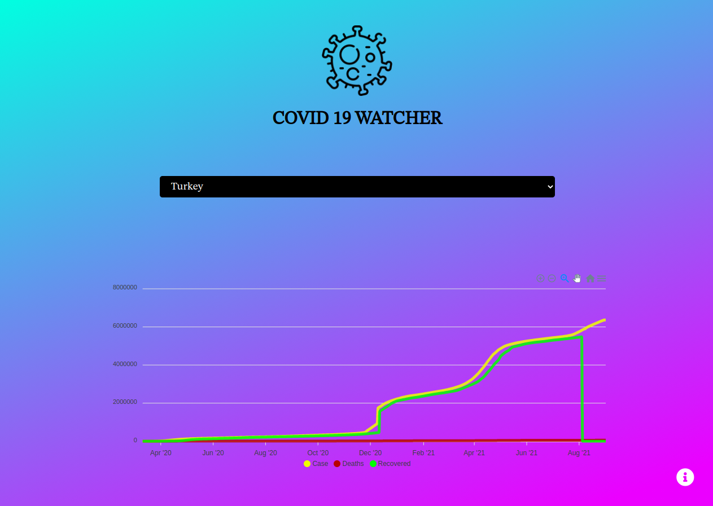
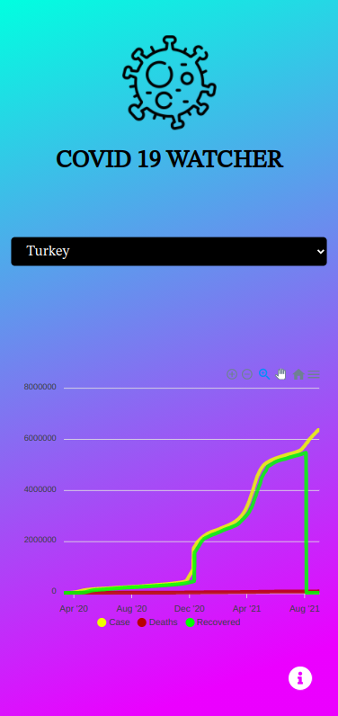

# **covid-19-watcher**

## About the project:
> covid-19-watcher was developed by Ali Polat in August 2021 using reactjs.

> The aim of the project is to show the covid-19 status of all countries, the entire daily covid 19 status during the pandemic of the countries selected from the Select field is visible in the table.

> Data shown for the Covid 19 situation :

* Cases
* Deaths
* Recovereds
## Images from the project:
#### _normal view_

#### _mobile view_

## Resources:
  * [Covid-19 api](https://api.covid19api.com)

## Installation:
* Make sure Node & NPM is installed on your computer.
* Navigate to the directory where the project is located and open the terminal.
* Type the following into the terminal:
**npm run start**
* The project is run

## Author:
**_Ali POLAT_**

**_There is no license. You can clone the project and use it as you wish. Good luck everyone_**

export NODE_OPTIONS=--openssl-legacy-provider